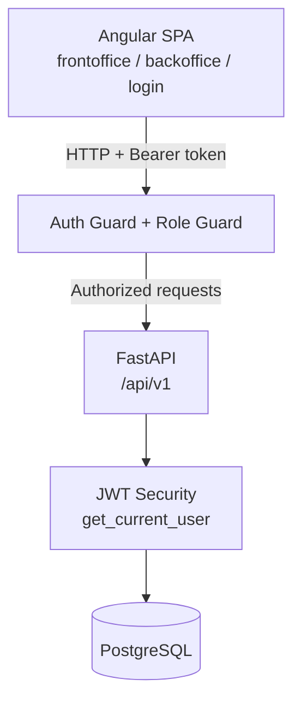
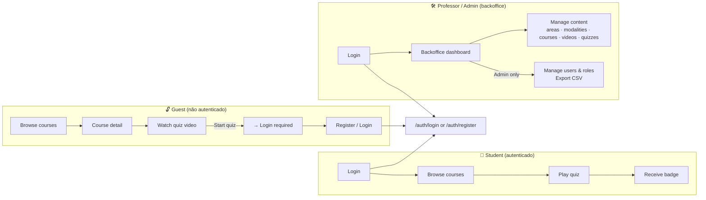
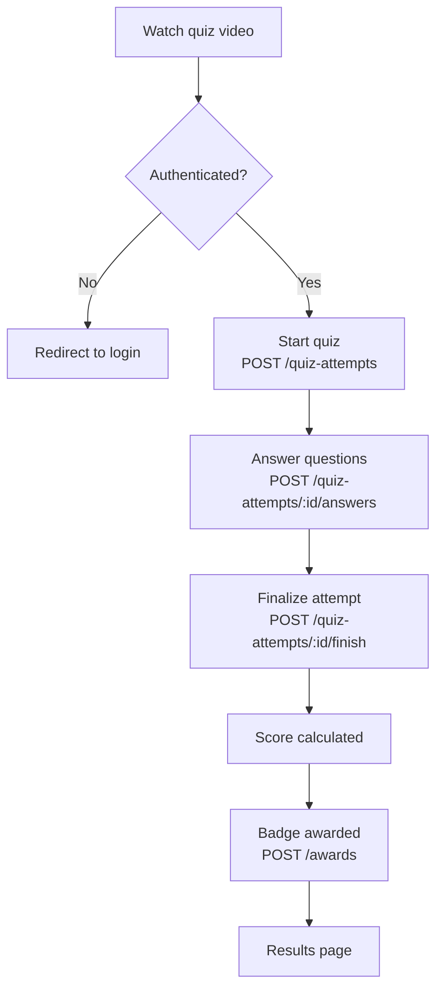

# 🎓 Islanders Fullstack


> Projeto académico fullstack que simula uma plataforma de e-learning real, com backoffice de gestão de conteúdo, sistema de quizzes com badges e autenticação com controlo de acessos por role.

---

## 🎬 Demo

<p align="left">
  <a href="https://youtu.be/NT8X4QytvTI" target="_blank">
    
  </a>
  <br>
  <ins>Clique na imagem acima para assistir ao vídeo completo no <b>YouTube</b></ins>
</p>

---

## 🏗️ Arquitetura do Sistema

O sistema é composto por um SPA Angular que comunica com uma API FastAPI via HTTP com autenticação Bearer. O controlo de acesso é aplicado em duas camadas: guards no frontend e `get_current_user` no backend.



---

## 👤 Fluxos por Role



---

## 🎯 Fluxo de Quiz



---

## 🔐 Roles & Permissões

| Ação | Guest | Student | Professor | Admin |
|------|:-----:|:-------:|:---------:|:-----:|
| Ver cursos e áreas | ✅ | ✅ | ✅ | ✅ |
| Ver vídeo de quiz | ✅ | ✅ | ✅ | ✅ |
| Iniciar e jogar quiz | ❌ | ✅ | ✅ | ✅ |
| Receber badges | ❌ | ✅ | ✅ | ✅ |
| Aceder ao backoffice | ❌ | ❌ | ✅ | ✅ |
| Gerir conteúdo (areas, courses, quizzes) | ❌ | ❌ | ✅ | ✅ |
| Gerir utilizadores e roles | ❌ | ❌ | ❌ | ✅ |
| Exportar CSV | ❌ | ❌ | ❌ | ✅ |

> **Nota:** O controlo de role é aplicado via guards no frontend. No backend, a autenticação é validada por `get_current_user`; `require_roles` está implementado em rotas críticas.

---

## ✨ Funcionalidades

### Autenticação & Sessão
- Login, registo e logout com JWT
- Refresh token automático via HTTP interceptor (em caso de 401)
- Sessão persistida em localStorage
- Registo cria utilizador com role **Guest** por defeito

### Frontoffice (público + autenticado)
- Listagem de cursos com filtros e paginação
- Detalhe de curso com vídeo associado
- Sistema de quiz completo: vídeo → tentativa → respostas → score → badge
- Páginas: home, about, community, courses, course detail, quiz video, quiz play

### Backoffice (Professor / Admin)
- Gestão de áreas, modalidades, cursos, vídeos, quizzes e perguntas
- Gestão de utilizadores e roles (Admin only)
- Exportação de dados em CSV (users, courses)
- Upload e exposição de ficheiros via media server

### Sistema de Badges & Awards
- Badge atribuído automaticamente após conclusão de quiz
- Rotas e modelos dedicados: `/awards`, `/badges`

---

## 🧰 Stack

### Backend
| Tecnologia | Uso |
|------------|-----|
| FastAPI | Framework principal, roteamento por domínio |
| Python | Linguagem base |
| PostgreSQL | Base de dados relacional |
| SQLAlchemy | ORM |
| Pydantic | Validação de schemas |
| JWT (python-jose) | Autenticação e refresh tokens |

### Frontend
| Tecnologia | Uso |
|------------|-----|
| Angular | Framework SPA |
| TypeScript | Linguagem base |
| RxJS | Gestão de streams e HTTP |
| Angular Signals | State management (AuthState) |
| HTTP Interceptors | Token injection + refresh automático |

---

## 📁 Estrutura do Projeto

### Backend (FastAPI)

```text
backend/
└── app/
    ├── api/              # Routes por domínio (users, roles, courses, quizzes, awards...)
    ├── core/             # Config, security, settings
    ├── db/               # Sessão e conexão à base de dados
    ├── models/           # ORM models (SQLAlchemy)
    ├── repositories/
    │   └── crud/         # Lógica CRUD por entidade
    ├── schemas/          # Pydantic schemas (request/response)
    ├── media/            # Uploads e exposição de ficheiros
    └── main.py           # Entrypoint + registo de routers
```

### Frontend (Angular)

```text
frontend/
└── src/app/
    ├── core/
    │   ├── interceptors/     # auth.interceptor, error.interceptor
    │   ├── guards/           # auth.guard, role.guard
    │   ├── state/            # auth.state (signals)
    │   └── layouts/
    │       ├── front-shell/  # Layout público
    │       ├── back-shell/   # Layout backoffice
    │       └── login-shell/  # Layout de autenticação
    ├── features/             # Módulos por domínio (courses, quiz, backoffice...)
    └── shared/               # Componentes e utilitários partilhados
```

---

## ⚙️ Instalação & Uso

### 1. Clonar o repositório

```bash
git clone https://github.com/lucas-morim/islanders-fullstack.git
cd islanders-fullstack
```

### 2. Backend

```bash
cd backend
pip install -r requirements.txt
uvicorn app.main:app --reload
```

Disponível em: `http://localhost:8000`  
Documentação automática: `http://localhost:8000/docs`

### 3. Frontend

```bash
cd frontend
npm install
ng serve
```

Disponível em: `http://localhost:4200`

---

## 🔀 Versionamento & Workflow Git

Projeto desenvolvido em equipa com branches por domínio e revisão obrigatória de PR antes de merge.

**Convenção de branches:**
```
frontend/feature-name   → trabalho de frontend
backend/feature-name    → trabalho de backend
```

**Regras de equipa:**
- PRs requerem aprovação do colega antes de merge
- Separação estrita entre trabalho de frontend e backend
- Commits descritivos com prefixo de domínio

---

## 📊 CRUD Status

| Módulo | Create | Read | Update | Delete |
|--------|:------:|:----:|:------:|:------:|
| Users | ✅ | ✅ | ✅ | ✅ |
| Roles | ✅ | ✅ | ✅ | ✅ |
| Areas | ✅ | ✅ | ✅ | ✅ |
| Modalities | ✅ | ✅ | ✅ | ✅ |
| Courses | ✅ | ✅ | ✅ | ✅ |
| Videos | ✅ | ✅ | ✅ | ✅ |
| Quizzes | ✅ | ✅ | ✅ | ✅ |
| Questions | ✅ | ✅ | ✅ | ✅ |
| Quiz Attempts | ✅ | ✅ | — | — |
| Awards / Badges | ✅ | ✅ | — | — |
| Auth | ✅ | ✅ | — | — |

---

## 👥 Equipa

Projeto desenvolvido a três, com separação de responsabilidades por domínio e revisão mútua de código.

- **Gonçalo Oliveira**: <https://github.com/goncalo-f-oliveira>
- **Lucas Morim**: <https://github.com/lucas-morim>
- **Ruben Teixeira**: <https://github.com/rubenfteixeira>

*Projeto académico - ISLA Gaia, 2024/2025*
