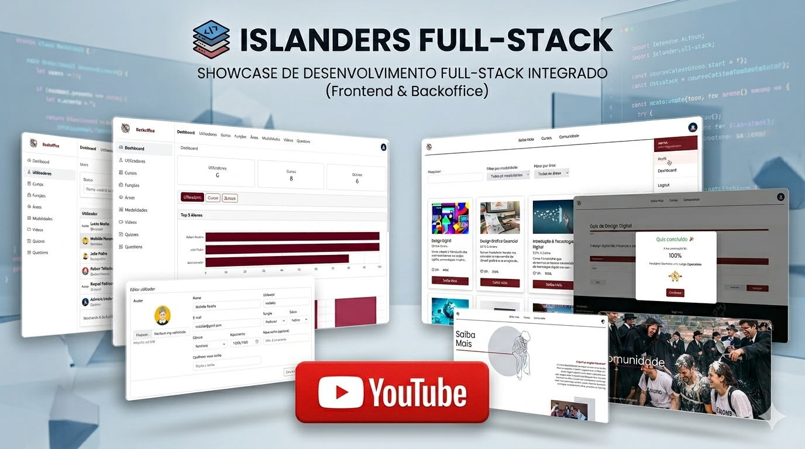
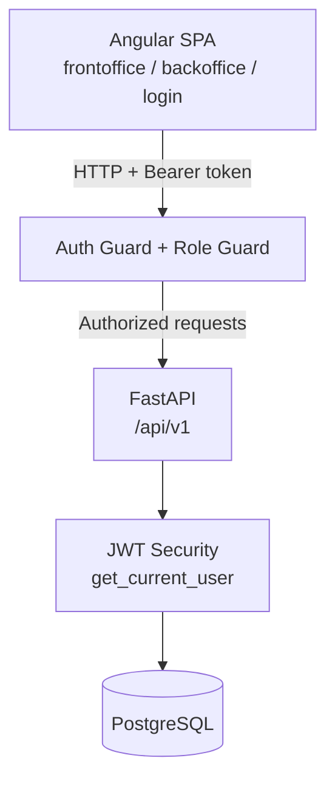
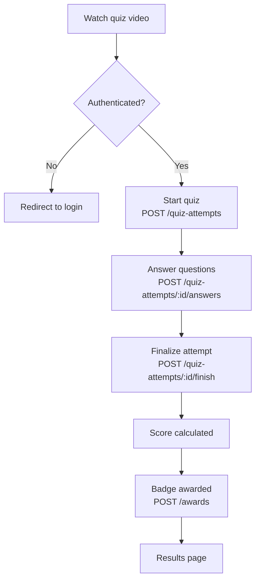

# 🎓 Islanders Fullstack


> Academic fullstack project simulating a real e-learning platform, with a content management backoffice, a quiz system with badges, and authentication with role-based access control.

---

## 🎬 Demo

<p align="left">
  <a href="https://youtu.be/sgD6pdATGyI" target="_blank">
    
  </a>
  <br>
  <ins>Click the image above to watch the full demo on <b>YouTube</b></ins>
</p>

---

## 🏗️ System Architecture

The system consists of an Angular SPA communicating with a FastAPI backend over HTTP using Bearer authentication. Access control is enforced at two levels: route guards on the frontend and `get_current_user` on the backend.



---

## 👤 User Flows by Role


---

## 🎯 Quiz Flow



---

## 🔐 Roles & Permissions

| Action | Guest | Student | Professor | Admin |
|--------|:-----:|:-------:|:---------:|:-----:|
| Browse courses and areas | ✅ | ✅ | ✅ | ✅ |
| Watch quiz video | ✅ | ✅ | ✅ | ✅ |
| Start and play quizzes | ❌ | ✅ | ✅ | ✅ |
| Receive badges | ❌ | ✅ | ✅ | ✅ |
| Access backoffice | ❌ | ❌ | ✅ | ✅ |
| Manage content (areas, courses, quizzes) | ❌ | ❌ | ✅ | ✅ |
| Export CSV | ❌ | ❌ | ✅ | ✅ |
| Manage users and roles | ❌ | ❌ | ❌ | ✅ |

> **Note:** Role enforcement is handled via guards on the frontend. On the backend, authentication is validated through `get_current_user`; `require_roles` is applied on critical routes.

---

## ✨ Features

### Authentication & Session
- Login, registration and logout with JWT
- Automatic token refresh via HTTP interceptor (on 401)
- Session persisted in localStorage
- Registration assigns the **Guest** role by default

### Frontoffice (public + authenticated)
- Course listing with filters and pagination
- Course detail page with associated video
- Full quiz flow: video → attempt → answers → score → badge
- Pages: home, about, community, courses, course detail, quiz video, quiz play

### Backoffice (Professor / Admin)
- Content management: areas, modalities, courses, videos, quizzes and questions
- User and role management (Admin only)
- CSV data export (users, courses)
- File upload and serving via media server

### Badges & Awards
- Badge automatically awarded after completing a quiz
- Dedicated routes and models: `/awards`, `/badges`

---

## 🧰 Stack

### Backend
| Technology | Purpose |
|------------|---------|
| FastAPI | Main framework, domain-based routing |
| Python | Core language |
| PostgreSQL | Relational database |
| SQLAlchemy | ORM |
| Pydantic | Schema validation |
| JWT (python-jose) | Authentication and token refresh |

### Frontend
| Technology | Purpose |
|------------|---------|
| Angular | SPA framework |
| TypeScript | Core language |
| RxJS | Stream and HTTP management |
| Angular Signals | State management (AuthState) |
| HTTP Interceptors | Token injection + automatic refresh |

---

## 📁 Project Structure

### Backend (FastAPI)

```text
backend/
└── app/
    ├── api/              # Domain routes (users, roles, courses, quizzes, awards...)
    ├── core/             # Config, security, settings
    ├── db/               # Database session and connection
    ├── models/           # ORM models (SQLAlchemy)
    ├── repositories/
    │   └── crud/         # CRUD logic per entity
    ├── schemas/          # Pydantic schemas (request/response)
    ├── media/            # File uploads and serving
    └── main.py           # Entrypoint + router registration
```

### Frontend (Angular)

```text
frontend/
└── src/app/
    ├── core/
    │   ├── interceptors/     # auth.interceptor, error.interceptor
    │   ├── guards/           # auth.guard, role.guard
    │   ├── state/            # auth.state (signals)
    │   └── layouts/
    │       ├── front-shell/  # Public layout
    │       ├── back-shell/   # Backoffice layout
    │       └── login-shell/  # Authentication layout
    ├── features/             # Domain modules (courses, quiz, backoffice...)
    └── shared/               # Shared components and utilities
```

---

## ⚙️ Installation & Usage

### 1. Clone the repository

```bash
git clone https://github.com/lucas-morim/islanders-fullstack.git
cd islanders-fullstack
```

### 2. Backend

```bash
cd backend
pip install -r requirements.txt
uvicorn app.main:app --reload
```

Available at: `http://localhost:8000`  
Auto-generated docs: `http://localhost:8000/docs`

### 3. Frontend

```bash
cd frontend
npm install
ng serve
```

Available at: `http://localhost:4200`

---

## 🔀 Versioning & Git Workflow

Built as a team project with domain-based branching and mandatory PR reviews before merging.

**Branch naming convention:**
```
frontend/feature-name   → frontend work
backend/feature-name    → backend work
```

**Team rules:**
- PRs require a teammate's approval before merging
- Strict separation between frontend and backend work
- Descriptive commits prefixed by domain

---

## 📊 CRUD Status

| Module | Create | Read | Update | Delete |
|--------|:------:|:----:|:------:|:------:|
| Users | ✅ | ✅ | ✅ | ✅ |
| Roles | ✅ | ✅ | ✅ | ✅ |
| Areas | ✅ | ✅ | ✅ | ✅ |
| Modalities | ✅ | ✅ | ✅ | ✅ |
| Courses | ✅ | ✅ | ✅ | ✅ |
| Videos | ✅ | ✅ | ✅ | ✅ |
| Quizzes | ✅ | ✅ | ✅ | ✅ |
| Questions | ✅ | ✅ | ✅ | ✅ |
| Quiz Attempts | ✅ | ✅ | — | — |
| Awards / Badges | ✅ | ✅ | — | — |
| Auth | ✅ | ✅ | — | — |

---

## 👥 Team

Built by three people, with domain-based responsibilities and mutual code review throughout the project.

[Gonçalo Oliveira](https://github.com/goncalo-f-oliveira) · [Lucas Morim](https://github.com/lucas-morim) · [Ruben Teixeira](https://github.com/rubenfteixeira)

*Academic project — ISLA Gaia, 2024/2025*
